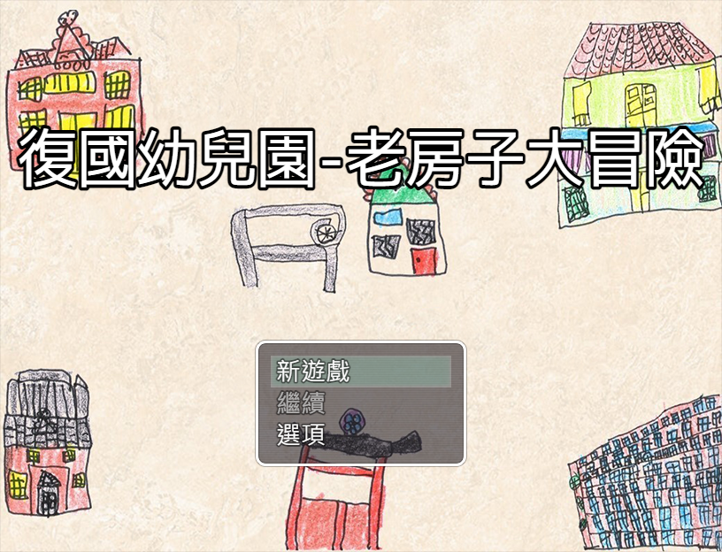
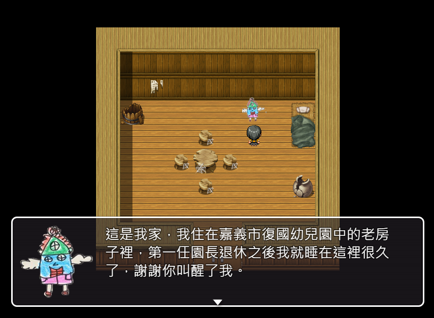
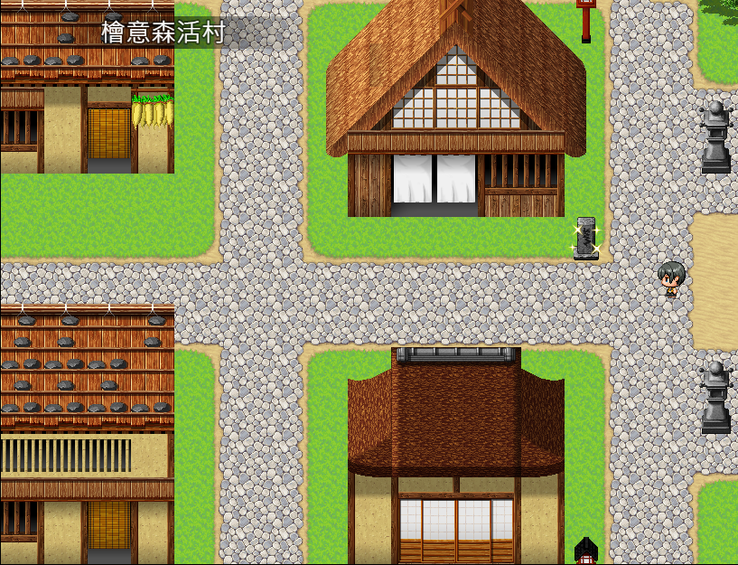

# Fukoo Kindergarten - Old House Adventure | Game Introduction

<!--  -->

# Fukoo Kindergarten - Old House Adventure :video_game:


Fukoo Kindergarten - Old House Adventure is an adventure game based on the theme of old houses around Fukoo Kindergarten. Children can explore these old houses through the game and learn about their history and culture. The game is full of puzzles and challenges, and children need to solve difficult problems, find hidden props, complete tasks, and explore every corner. Through this game, children can gain a deep understanding of the culture and background of these old houses and experience a unique adventure journey. The game provides both web and download versions, suitable for children who love puzzles and adventures.


---

## Game Features


- Realistic old house scenes that make you feel like you are there.
- Diverse game modes that challenge your intelligence and reflexes.
- Rich game props to help you complete tasks.
- Multiple branch storylines, allowing you to experience different adventure journeys.
- Exquisite game graphics and music that make you feel like you are in the game.


---

## How to Play

You can start playing the game directly through the web version link. **The download version of the game can be downloaded to your computer for better gaming experience.** (Currently supports web play and Windows version downloaded to your own Windows computer to play. Other system versions are not yet packaged.)

> **Web version game link:**
> - [:point_right:Click here to start playing:point_left:](https://jiunjiun69.github.io/Fukoo-OldHouseAdventure/)
>
---
> 
> **Download version game link:**
> 
> Computer version :computer: :
> - [Download Windows version game-__can be played directly__](https://drive.google.com/file/d/1kV2pd4seFwVgK_wfcSzrHXOEIgiaIHbR/view?usp=share_link) (After decompression, click on Game.exe to start playing directly)
> - ~~[Download Mac version game-__not yet packaged__](/Fukoo-OldHouseAdventure-Website/87?)~~
> - ~~[Download Linux version game-__not yet packaged__](/Fukoo-OldHouseAdventure-Website/87?)~~
>
> Mobile version :iphone: :
> - ~~[Download Android version game-__not yet packaged__](/Fukoo-OldHouseAdventure-Website/87?)~~
> - ~~[Download iOS version game-__not yet packaged__](/Fukoo-OldHouseAdventure-Website/87?)~~

---

## Game Flow


graph LR;
    A[Explore the content inside the old house] -->|Search for shining content| B(Talk to the appearing elf)
    B --> C{Choose an answer}
    C -->|Correct answer| D[Get a reward]
    C -->|Wrong answer| E[Challenge again]



---

## Game Screenshots

---

## Origin of the Game


- This game is based on the content of a children's storybook called "The Old House Near the School," which was created by a teacher and students of the Elephant Class at the Fu-Kuo Municipal Kindergarten in Chiayi. The game is designed as an RPG quiz type that allows children to interact and pass levels. The game is mainly guided by a character named "Old House Elf" who leads the children through the game.

- The storybook tells the story of an old house located in the Fu-Kuo Municipal Kindergarten in Chiayi. It used to be the residence of the first principal, but after the principal retired, the Old House Elf fell asleep. Later, the children of the kindergarten cleaned up the old house and woke up the Old House Elf. The game then introduces the stories of six old houses located in Chiayi, which will be presented to children through the gameplay.

- The Old House Elf will ask the children to collect some items from the other five old houses to help him renovate his shabby room. In each old house, the children will encounter a different elf and find various hints about the old house. By answering questions, they can obtain the items the Old House Elf needs. Once all the items from the five old houses are collected, the children return to the Fu-Kuo Municipal Kindergarten to deliver the items to the Old House Elf, and the game is cleared.

---

- Here are the six old buildings that will be introduced in the game :house: :

1. **:house: The old house in Fu Guo Kindergarten, Chiayi City**: This is the dormitory of the first principal and will also be the character that leads children to play in the game. In the game, it will be personified as an elf called "Old House" and will allow children to become familiar with the following old houses.
   
2. **:house: "Historical Data Museum" in Chiayi Park**: This 78-year-old old house is made of cypress wood and displays many stories from the past of Chiayi. Previously, the Historical Data Museum was a building attached to the Chiayi Shrine during the Japanese occupation, and it was also used as the 828 Army Hospital. Therefore, there are also photos of soldiers receiving medical treatment here.
   
3. **:house: Chiayi City Art Museum**: This 85-year-old building has many circular windows and is a combination of Chinese and Western architectural styles. It used to be the Chiayi branch of the Taiwan Tobacco and Liquor Corporation before it was renovated into an art museum. Many artworks are exhibited here.

4. **:house: "East Gate Church" near the school**: This 87-year-old Japanese-style building is made entirely of cypress wood. It is the only remaining building and shrine of Tenrikyo in Taiwan after the restoration of Taiwan. People come here to pray for peace.
   
5. **:house: Tainan Cafe**: This 96-year-old building has many small rooms. It used to be a maternity hospital, and each of these small rooms was a delivery room in the past. There are many beautiful tiles on the wall at the entrance of the Tainan Cafe, called "flower tiles." They are a precious set of six-piece jigsaw flower tiles that need to be carefully protected.
   
6. **:house: Cypress Living Village**: This is the largest and most complete preserved old house group in Taiwan, with a total of 31 old houses. The oldest one is 107 years old, and the houses are mainly covered with red cypress and Fuzhou pine. It used to be the residence of Japanese officials, but now it has been transformed into a forest-themed cultural and creative park by the Forestry Bureau. It is very lively and has become a famous new landmark.
