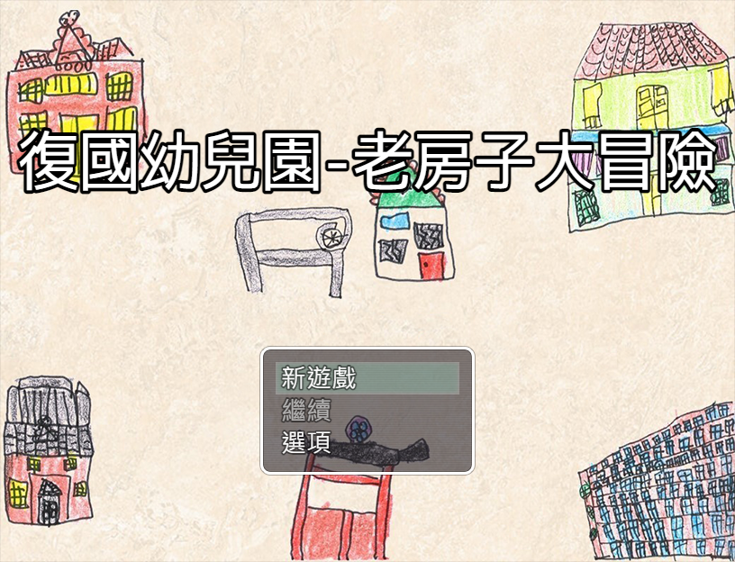
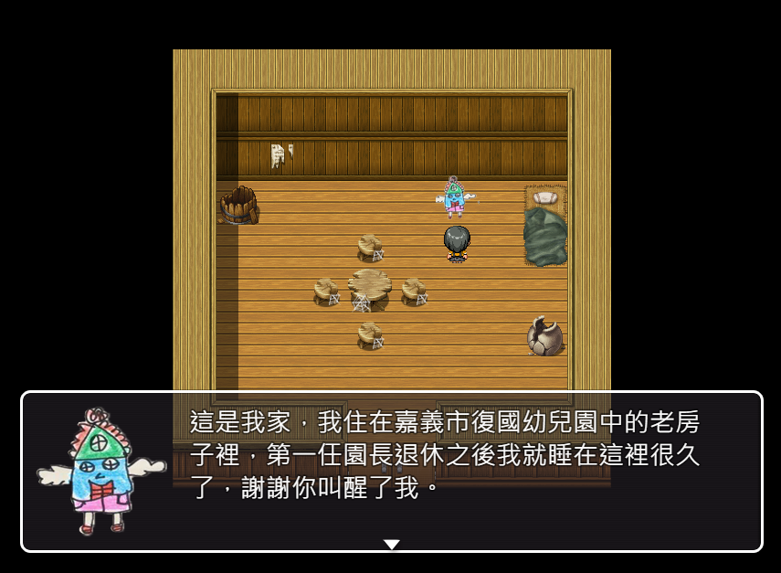
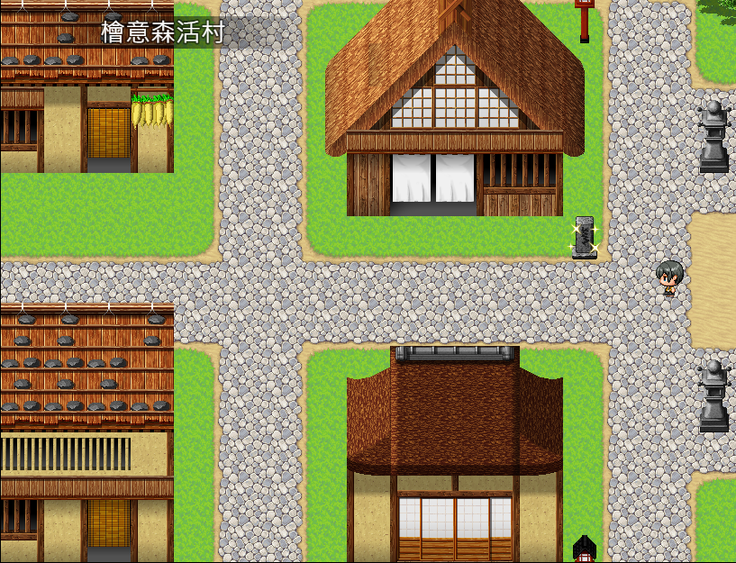

# 復國幼兒園-老房子大冒險 | 遊戲介紹

<!--  -->

# 復國幼兒園-老房子大冒險 :video_game:


《復國幼兒園-老房子大冒險》是一款以復國幼兒園周邊的老房子為主題的冒險遊戲，小朋友可以透過遊戲探索這些老房子，了解它們的歷史和文化。遊戲中充滿了謎題和挑戰，小朋友需要解決難題、尋找隱藏的道具、完成任務和探索每個角落。透過這個遊戲，小朋友可以深入了解這些老房子的文化和背景，體驗一次獨特的冒險旅程。遊戲提供網頁版和下載版，適合喜愛解謎和探險的小朋友。


---

## 遊戲特色


- 真實的老房子場景，讓你身歷其境。
- 多樣的遊戲模式，挑戰你的智力和反應能力。
- 豐富的遊戲道具，幫助你完成任務。
- 多條支線故事，讓你體驗不同的冒險旅程。
- 精美的遊戲畫面和配樂，讓你感受到身臨其境的遊戲體驗。


---

## 遊玩方式

可以直接透過網頁版遊戲連結開始遊戲，**下載版遊戲載點可以下載遊戲到您的電腦中進行遊玩，以獲得更好的遊玩體驗。**(目前支援網頁遊玩、以及Windows版下載到自己Windows電腦上玩，其他系統的版本尚未封裝)

> **網頁版遊戲連結：** 
> - [:point_right:點我直接開始遊戲:point_left:](https://jiunjiun69.github.io/Fukoo-OldHouseAdventure/)
>
---
> 
> **下載版遊戲載點：** 
> 
> 電腦版 :computer: :
> - [Windows 版遊戲下載-__可以直接遊玩__](https://drive.google.com/file/d/10BX_9QLOf7vtHDZZOJYdf3BOy1S1o86t/view?usp=share_link) (解壓縮後，點擊Game.exe就可以直接遊玩了)
> - ~~[Mac 版遊戲下載-__尚未封裝__](/files/)~~
> - ~~[Linux 版遊戲下載-__尚未封裝__](/files/)~~
>
> 手機版 :iphone: :
> - ~~[Android 版遊戲下載-__尚未封裝__](/files/)~~
> - ~~[iOS 版遊戲下載-__尚未封裝__](/files/)~~

---

## 遊戲流程


graph LR;
    A[探索老房子內容] -->|搜索亮晶晶的內容| B(與出現的小精靈對話)
    B --> C{選擇答案}
    C -->|答對| D[取得獎賞]
    C -->|答錯| E[重新挑戰]



---

## 遊戲截圖

---

## 遊戲由來


- 本遊戲透過一本嘉義市立復國幼兒園-大象班的老師與小朋友們共同製作的《學校附近的老房子》兒童故事繪本的內容來製作可以給小朋友互動答題並通關的RPG對答類型的遊戲，主要會由一個稱為老房子小精靈的角色來引導小朋友遊玩。

- 故事繪本的內容大概是在說，嘉義市的復國幼兒園裡有一間老房子，是第一任園長的宿舍，隨著園長退休，老房子小精靈就睡著了，後來幼兒園的孩子將老房子打掃乾淨，將老房子小精靈叫醒了，隨後遊戲中會陸續介紹六間嘉義市其他老房子建築的故事，本遊戲也會透過遊玩的方式呈現給小朋友這些內容。

- 老房子小精靈會要求小朋友去另外五家老房子朋友中收集一些物品來幫助他改造破舊的房間，小朋友到不同老房子中都會遇到不同的老房子中的小精靈，可以在房間中找到各種介紹老房子的提示，並透過回答問題獲得老房子小精靈需要的物品，最後五間老房子的物品都收集完後，回到復國幼兒園內交給老房子小精靈，就算遊戲通關。

---

- 以下是遊戲中會介紹到的六家老建築 :houses: :

1. **:house: 嘉義市立復國幼兒園裡的老房子**：第一任園長的宿舍，也是本遊戲中會帶領小朋友遊玩的角色，遊戲中會將它擬人化，稱為老房子小精靈，並讓小朋友熟悉下面幾個老房子。
   
2. **:house: 嘉義公園裡的"史蹟資料館"**：已經78歲了，是用檜木蓋的老房子，展示很多嘉義以前的故事，以前史蹟資料館是日治時代嘉義神社附屬的齋館跟社務所，以前也曾經作為國軍828醫院使用，所以也有阿兵哥在此看醫生的照片。
   
3. **:house: 嘉義市立美術館**:有很多圓形窗戶，已經85歲了，是一個中西式建築，以前是菸酒公賣局嘉義分局，後來才改建成美術館，有展出許多美術作品。
   
4. **:house: 學校附近的"東門教會"**：已經87歲了，整棟都是用檜木蓋的日式建築，是台灣光復後唯一保留建物與神龕的天理教會，大家都會在此祈求平安。
   
5. **:house: 提娜多咖啡**：已經96歲了，裡面有很多小小的房間，提娜多咖啡以前原本是婦產科醫院，這一間一間的小房間都是以前的待產室，提娜多咖啡的門口牆上有許多漂亮的磁磚，稱為花磚，是珍貴的六塊式拼圖花磚，需要小心保護。
   
6. **:house: 檜意森活村**：是台灣保存最完整，範圍最大的老房子群，總共有31棟老房子，最老的那棟已經107歲了，房子主要都是使用紅檜及福州杉蓋的，以前這裡是日本官員的宿舍，現在這裡則是被林務局林管處打造為以森林為主題的文創園區，非常熱鬧，已經是一個著名的新地標了。

