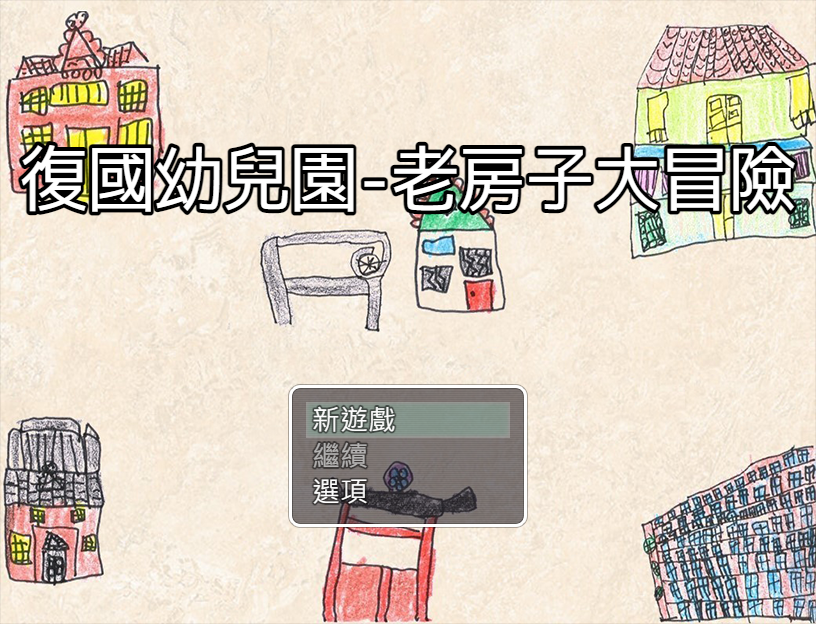
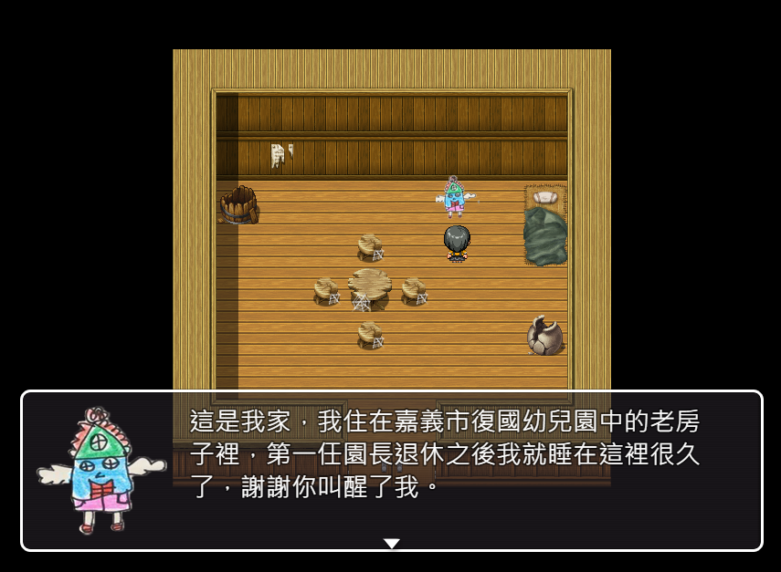
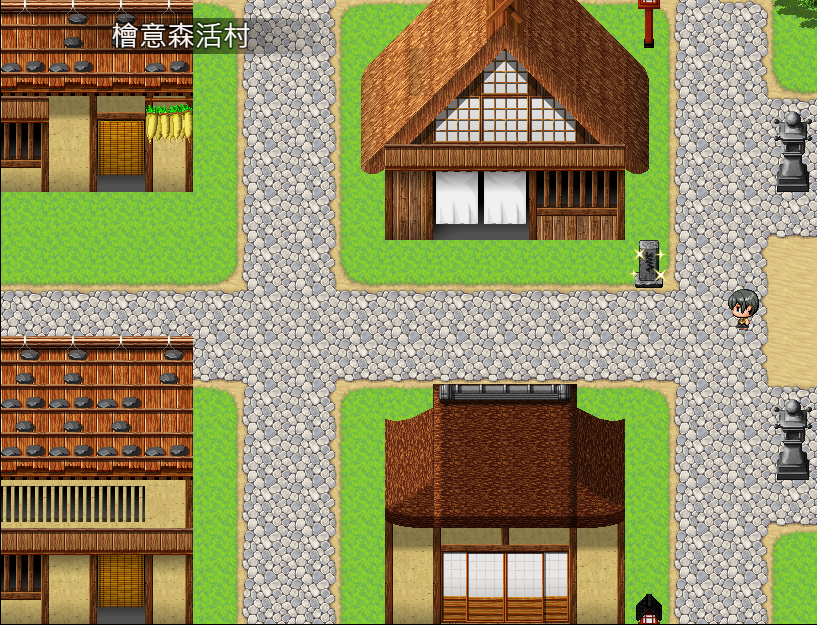

# 復國幼兒園-老房子大冒險 | 遊戲介紹

<!--  -->

# 復國幼兒園-老房子大冒險

《復國幼兒園-老房子大冒險》是一款以復國幼兒園周邊的老房子為主題的冒險遊戲，玩家可以透過遊戲探索這些老房子，了解它們的歷史和文化。遊戲中充滿了謎題和挑戰，玩家需要解決難題、尋找隱藏的道具、完成任務和探索每個角落。透過這個遊戲，玩家可以深入了解這些老房子的文化和背景，體驗一次獨特的冒險旅程。遊戲提供網頁版和下載版，適合喜愛解謎和探險的玩家。

## 遊戲特色

- 真實的老房子場景，讓你身歷其境。
- 多樣的遊戲模式，挑戰你的智力和反應能力。
- 豐富的遊戲道具，幫助你完成任務。
- 多條支線故事，讓你體驗不同的冒險旅程。
- 精美的遊戲畫面和配樂，讓你感受到身臨其境的遊戲體驗。

## 遊玩方式

可以直接透過網頁版遊戲連結開始遊戲，**下載版遊戲載點可以下載遊戲到您的電腦中進行遊玩，以獲得更好的遊玩體驗。**

> **網頁版遊戲連結：** [點我直接開始遊戲](https://jiunjiun69.github.io/Fukoo-OldHouseAdventure/)
> 
> **下載版遊戲載點：** [遊戲下載](https://jiunjiun69.github.io/Fukoo-OldHouseAdventure/)

## 遊戲截圖

